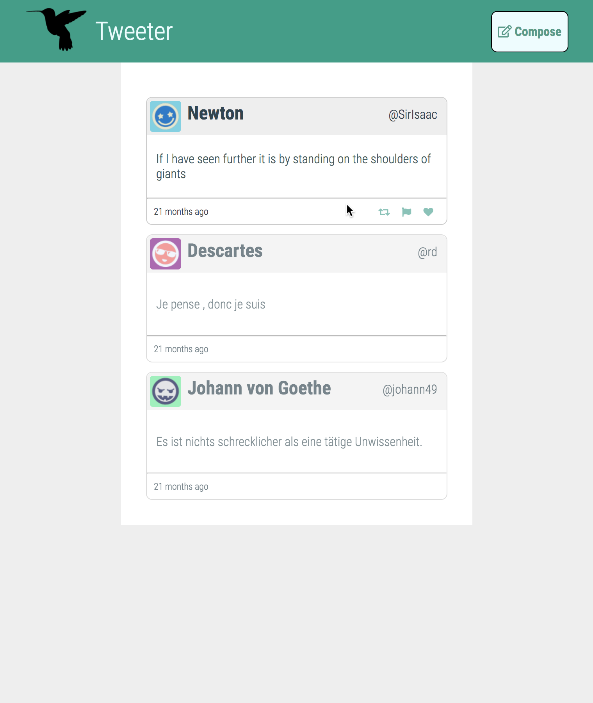
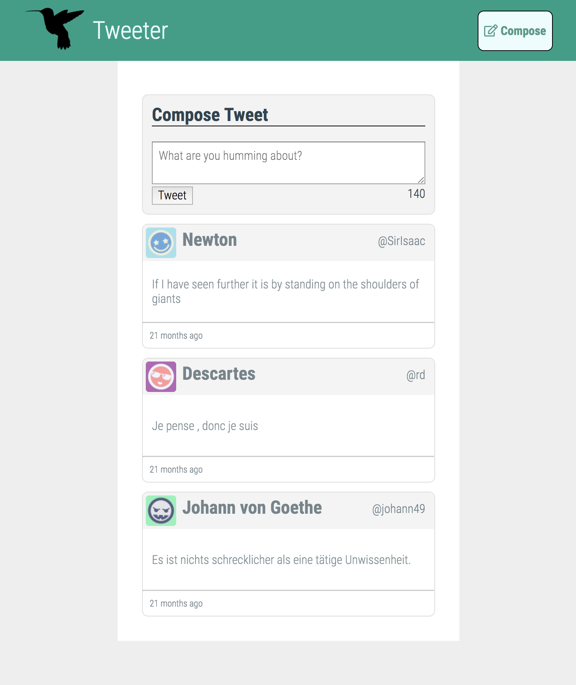
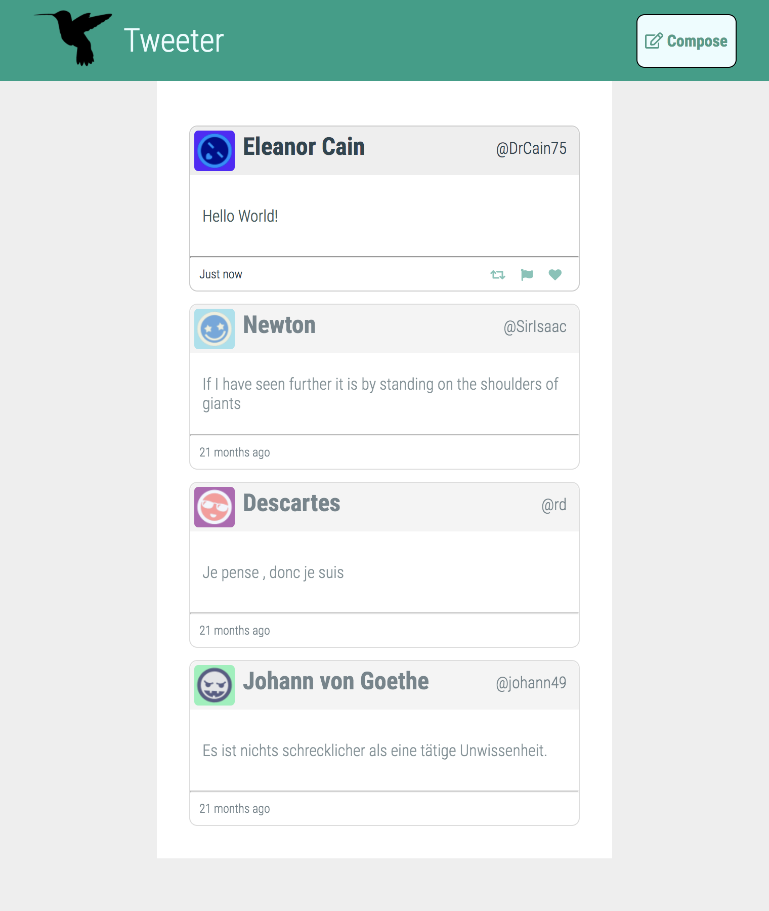
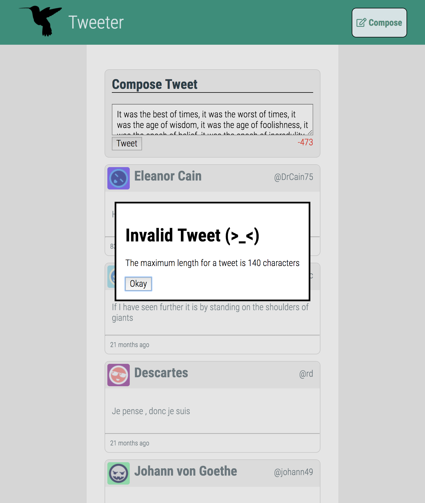

# Tweeter Project

Tweeter is a simple, single-page Twitter clone made to practice front end development skills.
[TOC]
## Screenshots







## Tech Employed

- Front-End
  - HTML5
  - CSS3
  - JS / jQuery / AJAX
- Back-End
  - Node
  - Express
  - MongoDB

## Running a local instance

1. Fork this repository, then clone your fork of this repository.
2. Install dependencies using the `npm install` command.
3. Start the web server using the `npm run local` command. The app will be served at <http://localhost:8080/>.
4. Go to <http://localhost:8080/> in your browser.

## Dependencies
- Node 5.10.x or above with NPM
- Node dependencies:
```
    "body-parser": "^1.15.2",
    "chance": "^1.0.2",
    "express": "^4.13.4",
    "md5": "^2.1.0",
    "mongodb": "^2.2.34"
```

