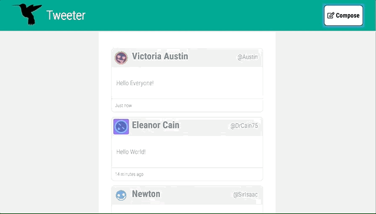

# Tweeter Project

Tweeter is a simple, single-page Twitter clone made to practice front end development skills.
[TOC]
## Screenshots




## Tech Employed

- Front-End
  - HTML5
  - CSS3
  - JS / jQuery / AJAX
- Back-End
  - Node
  - Express
  - MongoDB

## Running a local instance

1. Fork this repository, then clone your fork of this repository.

2. Install dependencies using the `npm install` command.

3. Start the web server using the `npm run local` command. The app will be served at <http://localhost:8080/>.

4. Go to <http://localhost:8080/> in your browser.

## Configuring a local instance

Settings for the application server are are set within `/servers/index.js` near the top of the file. They look like this:
```
/** Settings */
const MONGODB_URI = "mongodb://localhost:27017/tweeter";
const APP_PORT = 8080;
const STATIC_DIR = path.join(__dirname, "../public");
const SASS_DIR = path.join(STATIC_DIR, "sass");
const STYLES_DIR = path.join(STATIC_DIR, "styles");
```
It starts with the assumption that you want to serve the app from port 8080 and that you have a default installation of MongoDB. These can be changed if you have other needs.

To change the port that the app is served from:  `const APP_PORT = <Your Port Number>;`
To change the database location: `const MONGODB_URI = "<Your mongo database connection string>"`

## Dependencies
- Node 5.10.x or above with NPM
- Node dependencies:
```
    "body-parser": "^1.15.2",
    "chance": "^1.0.2",
    "express": "^4.13.4",
    "md5": "^2.1.0",
    "mongodb": "^2.2.34"
```
- MongoDB

